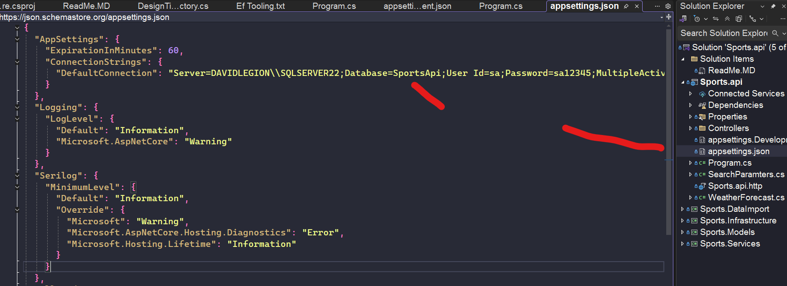
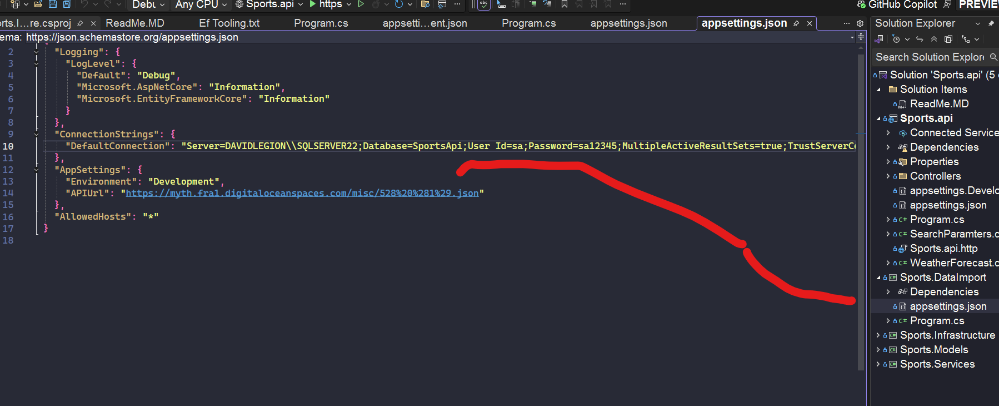
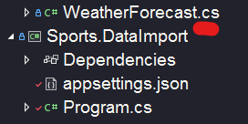
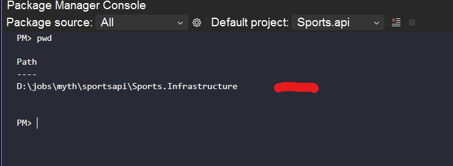
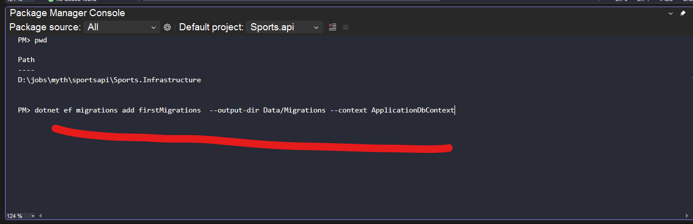
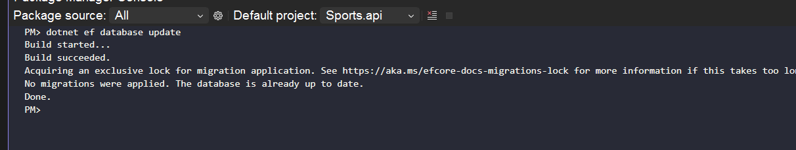
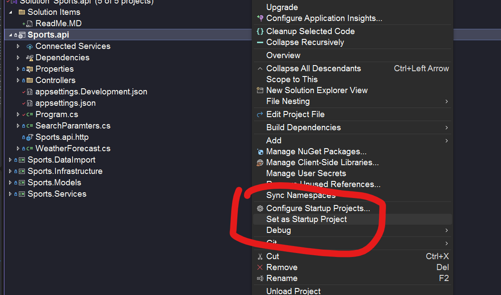

1 Sports.api — point it to your SQL Server instance.
Create a blank database called SportsAPI and change
the connection string in Sports.api to point to it, including the username,
password, and server name.

2 Then do the same for Sports.DataImport. This is how we are
going to import the data from the URL. Change the appsettings
here as well to point to your SQL Server instance and the same database you created in step 1.

3 Open the Package Manager Console once your settings have been updated.
In Visual Studio, run the following commands. Make sure you are in the correct directory —

You can check by running the pwd command, then cd into:

Sports.Infrastructure

4 Delete the Migrations folder in Sports.Infrastructure,
located at Data\Migrations. Remove the entire folder.

5 Then run the following command in the Package Manager Console:

	dotnet ef migrations add firstMigrations  --output-dir Data/Migrations --context ApplicationDbContext

This will recreate the Migrations folder. If you look
at your SQL Server instance, you will see the tables created.

6Now that the migrations are created, update the database by running the following command in the Package Manager Console:

    dotnet ef database update  

7 Once that’s done, you can run the Sports.DataImport project. Let it complete.

This will import the data from the URL into your database.

Once that is done, you can run the Sports.api project and it will be able to access the data.
You can then use the endpoints to retrieve the data.

 